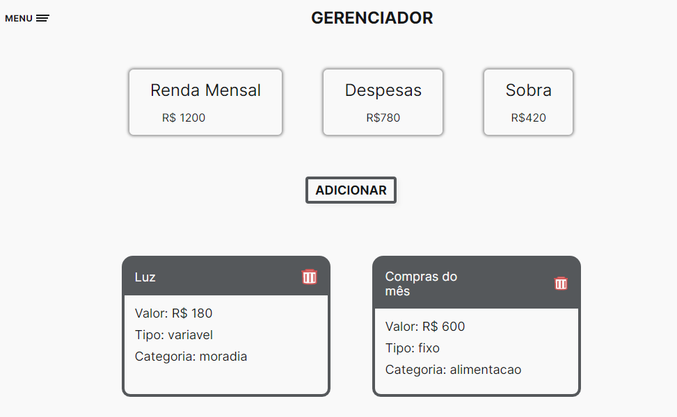
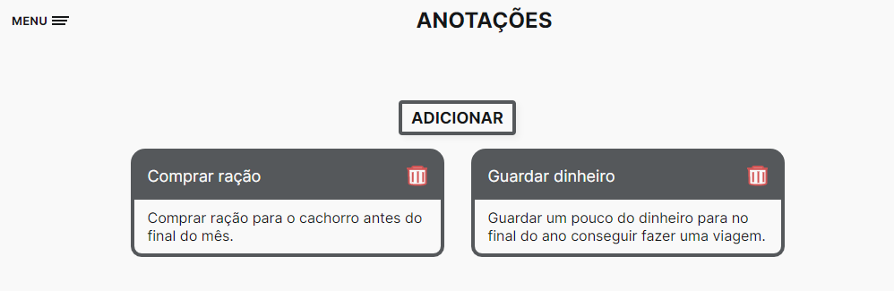

<h1 align='center'>Gerenciador de gastos </h1>
<h3 align='center'>
  <a href="#tecnologias">Tecnologias</a> |
  <a href="#sobre">Sobre</a> |
  <a href="#pre-requisitos">Pré-requisitos</a> 
</h3>

# Tecnologias
Para a construção do projeto utilizei as seguintes tecnologias:
  <ul> 
    <li>HTML</li>
    <li>CSS</li>
    <li>JavaScript</li>
    <li>NodeJS</li>
    <li>ExpressJS</li>
  </ul>

# Sobre
<p>  O objetivo do projeto é auxiliar no controle de gastos mensais, mostrando ao usuário informaçoes rápidas como por exemplo:</p>
  <ul>  
    <li>Renda Mensal</li>
    <li>Despesas totais</li>
    <li>Valor que sobrou</li>
  </ul>

<p> Além de informações mais completas como por exemplo, a quantidade gasta em cada categoria. São essas:</p>
  <ul>  
    <li>Moradia</li>
    <li>Transporte</li>
    <li>Alimentação</li>
    <li>Entreterimento</li>
    <li>Outros</li>
  </ul>

## Pagina home

<hr/>

## Pagina gastos

<hr/>

## Pagina anotações

<hr/>

## Funcionalidades

  - [X]Salvamento automatico dos dados
  - [X]Tela inicial com resumo das informações
  - [X]Adicionar o valor do gasto
  - [X]Adicionar o tipo do gasto(fixo/variavel)
  - [X]Escolha de categorias de gasto
  - [X]Adicionar anotações
  - [X]Apagar todos os dados
  - [X]Responsivo

## 

# Pre-requisitos

Para testar o projeto na sua maquina você irá precisar das seguintes ferramentas:
[Git](https://git-scm.com/), [NodeJS](https://nodejs.org/en/). Além disso é ideal usar um bom editor para trabalhar com código como o [VSCode](https://code.visualstudio.com/)

```bash
#Clone este repositorio

$ git clone <https://github.com/viteydev/gerenciador-de-gastos>

#Lembre-se de acessar a pasta do projeto

$ cd gerenciador-de-gastos

#Assim que estiver na pasta, adicione o seguinte comando

$ npm install

#Dessa forma as dependencias da aplicação serão baixadas e o projeto podera funcionar corretamente.

#Agora basta iniciar o projeto

$ npm start

#O servidor inciará na porta:5000 - acesse <http://localhost:5000>
```

#### Feito por Vitor 👍 | Veja meu [Linkedin](https://www.linkedin.com/in/vitor-lemos-1a61b3238/)
